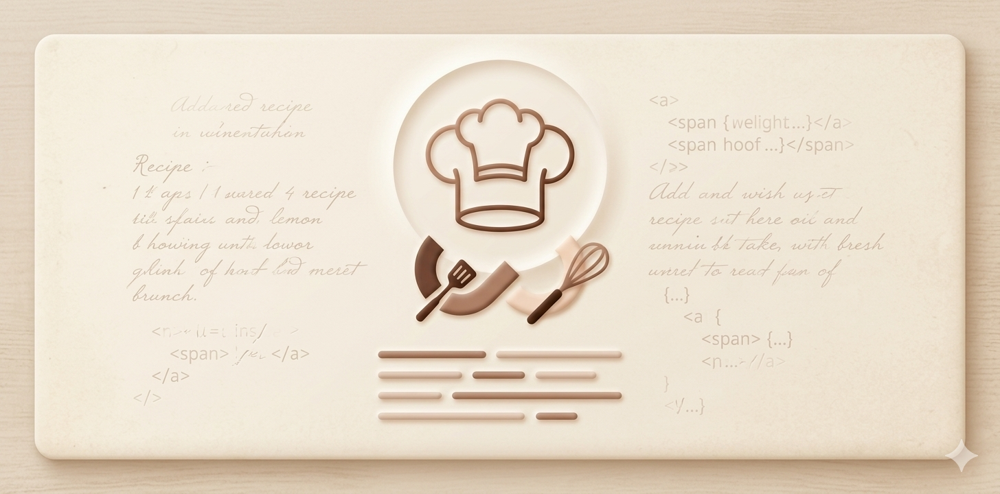

<div align="center">
  

  <h1>🍳 The Nostalgia Cookbook 🍳</h1>
  <p><strong>A Privacy-First, AI-Powered Voice Archiver for Family Recipes & Memories</strong></p>

  <p>
    <a href="https://ai.studio">✨ View in AI Studio</a> •
    <a href="#-features">🚀 Features</a> •
    <a href="#-tech-stack">🛠️ Tech Stack</a> •
    <a href="#-getting-started">💻 Getting Started</a> •
    <a href="#-deployment">🌐 Deployment</a>
  </p>
</div>

---

## 📖 Overview

**The Nostalgia Cookbook** is a privacy-focused web application designed to help families digitally archive heirloom cooking traditions. Instead of forcing older generations to navigate complex typing interfaces, users simply upload raw audio files (`.mp3`, `.wav`, `.m4a`) or record voice logs directly inside a vintage, kitchen-card-themed user interface. 

The application transcribes the audio streams and leverages a smart, hybrid pipeline to intelligently isolate structured recipe data (ingredients, quantities, dynamic unit conversions) from the emotional family stories, historical contexts, and anecdotes woven into the recording.

---

## 🚀 Features

*   **🎙️ Multimodal Audio Ingestion:** Record audio natively in-browser or upload voice recordings directly.
*   **🧠 Hybrid AI Extraction Pipeline:** Verbatim speech transcription layered with structured local AI separation engines.
*   **🛡️ Absolute Data Privacy:** Personal family stories, names, and memories are processed entirely within a self-hosted environment.
*   **📊 Dynamic Scaling & Structuring:** Converts messy streams of consciousness into clean, beautifully formatted recipe cards with ingredients, culinary steps, and a separate narrative log.

---

## 🛠️ Tech Stack

| Layer | Technology | Purpose |
| :--- | :--- | :--- |
| **Frontend & Backend** | `Next.js 15 (App Router)` | Application architecture and layout routing |
| **Runtime Engine** | `Bun` | Fast, out-of-the-box TypeScript engine execution |
| **Database** | `MongoDB Atlas` | Persistent storage for structured recipes and family timelines |
| **Ingestion Layer** | `Gemini 2.5 Flash` | Ultra-fast audio transcription parsing via `@google/genai` |
| **Extraction Core** | `Gemma 2 (9B)` | Self-hosted open-weight privacy engine via `Ollama` |
| **Containerization** | `Docker` | Uniform image packaging and sandboxed system building |

---

## 💻 Getting Started

### 📋 Prerequisites

Ensure you have the following frameworks installed locally:
*   [Bun](https://bun.sh) (Recommended runtime engine) or Node.js
*   [Ollama](https://ollama.com) (For local open-weight model serving)

---

### 🛠️ Local Installation Steps

1. **Clone the Repository**
   ```bash
   git clone https://github.com
   cd the-nostalgia-cookbook
   ```

2. **Install Local Dependencies**
   ```bash
   bun install
   # Or alternatively: npm install
   ```

3. **Set Up the Local LLM**
   Make sure Ollama is running on your engine, then download the structured processing model:
   ```bash
   ollama run gemma2:9b
   ```

4. **Configure Environment Variables**
   Create a `.env.local` file in the root directory and append your specific configuration parameters:
   ```env
   # AI API Keys
   GEMINI_API_KEY="your-gemini-api-key-here"
   OLLAMA_HOST="http://localhost:11434"

   # Database Settings
   MONGODB_URI="your-mongodb-atlas-connection-string"

   # Authentication Configuration
   NEXTAUTH_URL="http://localhost:3000"
   NEXTAUTH_SECRET="your-generated-jwt-secret-string"
   GOOGLE_CLIENT_ID="your-google-oauth-client-id"
   GOOGLE_CLIENT_SECRET="your-google-oauth-client-secret"
   ```

5. **Fire Up the Development Server**
   ```bash
   bun run dev
   # Or alternatively: npm run dev
   ```
   Open [http://localhost:3000](http://localhost:3000) inside your web browser to interact with the dashboard.

---

## 🌐 Deployment

### 🐳 Container Building (Docker)
The app includes configuration setups to build independent Docker images for standard cloud execution environments:
```bash
docker build -t nostalgia-cookbook .
docker run -p 3000:3000 --env-file .env.local nostalgia-cookbook
```

### 🚀 DigitalOcean App Platform Integration
This application is optimized to deploy directly via the **DigitalOcean App Platform**:
*   **Build Command:** `bun run build`
*   **Run Command:** `bun server.ts`
*   **Required Buildpacks:** Ensure the `Bun` buildpack takes precedence over the standard Node.js module container build layer.
*   **OAuth Mapping:** Ensure `https://digitalocean.app` is fully whitelisted inside your Google Cloud Developer Console.
